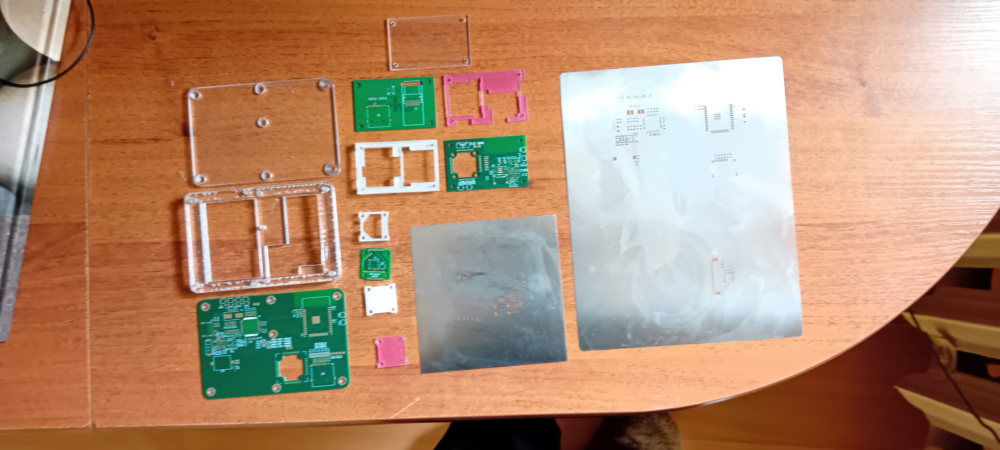
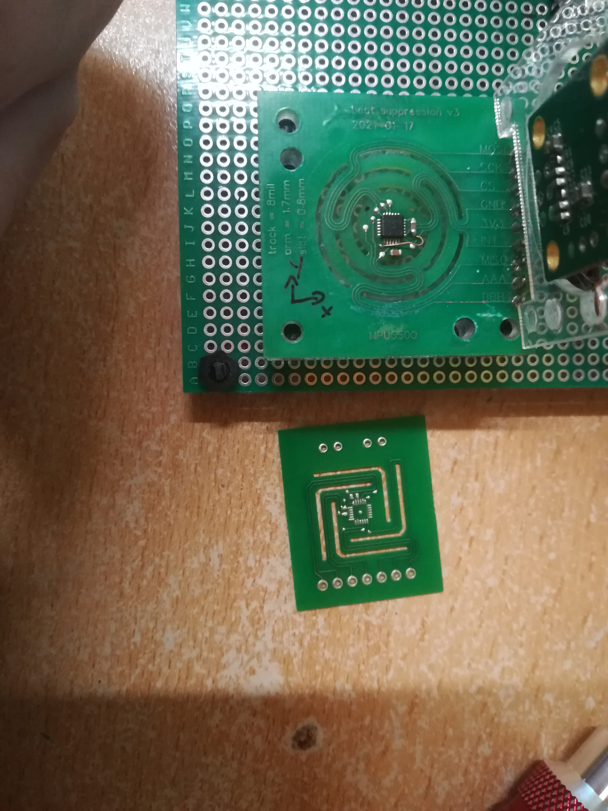
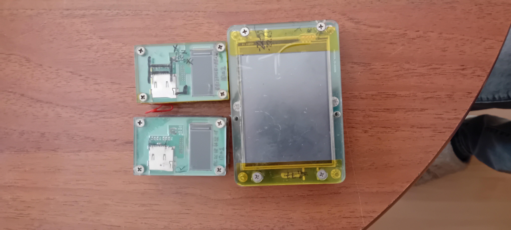
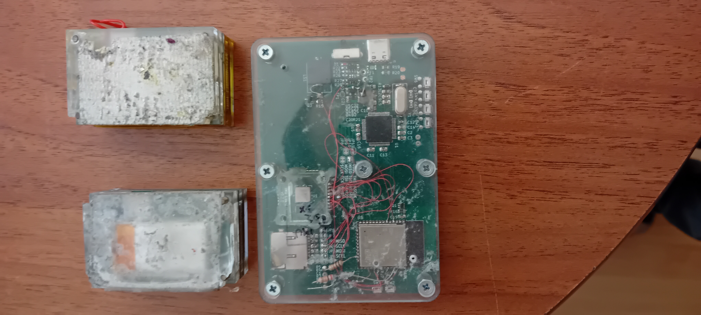

## Angle meter

Repozytorium to pełni funkcję portfolio technicznego. Z tego względu prezentuję tutaj architekturę, wyzwania inżynierskie oraz efekty końcowe projektu, jednak kod źródłowy nie jest publicznie udostępniany.
Wynika to z obecności autorskich, kluczowych rozwiązań algorytmicznych i technologicznych, które w przyszłości planuję skomercjalizować.

W odróznieniu do większości kątomierzy które mierzą kąty wyłącznie w jednej płaszczyźnie (w płaszczyźnie wektora grawitacji), moje rozwiązanie oferuje możliwość pomiaru kąta w dowolnej płaszczyźnie, z dokładnościa do 0.001 stopnia, w dowolnej osi obrotu w oparciu o dane z akcelerometru i specjalnie opracowanej metodzie przetwarzania danych wykorzystującej między innymi kwaterniony, algebrę wektorową oraz cyfrowej filtracji sygnału. Dodatkowo urządzenie skłąda się z kilku niezależnych części i komunikują się bezprzewodowo do głównego panelu z wyświetlaczem

## Kluczowe funkcjonalności
* pomiar w dowolnej osi obrotu
* możliwość pomiaru z wielu urządzeń pomiarowych jednocześnie (aktualnie 2 + 1 zabudowany w urządzeniu odbiorczym)
* dokładność pomiaru do 0.001 stopnia (w zależności od warunków), np. jest w stanie wykryć uginanie się parkietu przechodząc po podłodze w odległości ok 1,5m
* bezprzewodowe urządzenie pomiarowe (łatwe operowanie w trudno dostępnych miejscach)
* pełna kompensacja temperaturowa i orientacyjna
* podgląd na PC w identycznym interfejsie jak na dedykowanym wyświetlaczu w czsie rzeczywistym
## Wyzwania Inżynierskie
* W międzyczasie opracowywania kolejnych prototypów zagłębiałem się co raz głębiej w algorytmikę w poszikiwaniu odpowiedniej metody. Macierze, kąty eulera, axis angles, kwaterniony, filtry kalmana, filtry IIR i FIR, PCA, statystyka, solvery, gimbal lock, szumy, liczby urojone itd., przez te i wiele więcej zagadniej przebrnąłem nim znalazłem rozwiązanie mojego problemu. Wszystkie zaganienia przeliczałem na papierze i od 0 pisałem cały kod w celach edukacji oraz pełnej kotroli nad kodem, jedynym wyjątkiem jest tutaj PCA po które sięgnąłem do matlaba
* trudność w znalezniu gotowego rozwiązania matematycznego zaganienia zmusiła mnie do opracawania autorskiej metody
* mimo zastosowania wysokiej klasy 20 bitowego akcelerometru ten nadal wymaga dokładnej kalibracji i kompensacji temperaturowej
* zastosowanie komunikacji bezprzewodowej utrudnia późniejszą legalna komercjalizację z tytułu wymaganego certyfikatu FFC co wymusiło użycie gotowej płytki ESP32 zamiast projektowania całości od 0
* sama kompensacja temperatury jest niewystarczająca, na pomiar wpływa także tempo zmian temp. i gradient temperaturowy, wymagane było opracowanie specjalego PCB minimalizujące pojemność cieplną modułu pomiarowego przy jednoczesnym zachowaniu sztywności aby zminimalizować odkształcenia i podatność na uszkodzenia
* zaprojektowanie dedykowanych PCB dla łatwiejszego debugowania, awkizycji danych, kompaktowości
* urządzenie z czasem osiągało na tyle dużą dokładność, że koniecznością stało się zakupienie granitowej płyty traserskiej w celu poprawy procelu kalibracji oraz upakowanie wszystkiego w solidnej obudowie
* opracowanie niezawodnej komunikacji bezprzewodowej, aktualnie ESP-NOW
* opracowanie komunikacji między urządzeniem odbiorczym a PC z wykorzystaniem USB
* zaprojektowanie wizualizacji pomiarowych
* praca z ESP32 wymunisła na mnie naukę pracowania w środowiku RTOS (2 rdzenie), zarządzania taskami, programowania współbieżnego
* moja pedantyczna natura i chęć pełnej kotroli nad kodem zniechecała mnie używania gotowych bibliotek, nie licząc kilku drobnych wyjątków np. sterownik wyświetlacza cały kod starałem się pisać od zera w tym dla poszerzania własnej wiedzy

## Stan projektu
* główne założenie projektowe zostało osiągnięte i pomiary są zadowalające
* projekt został czasowo zawieszony ze względu na konieczność zmiany pracy i przejście na system 3 zmianowy
* dzięki osiągniętej wysokiej precyzji pomiaru oraz zaznajomieniu się z wieloma zaganieniami matematycznymi widzę potencjał na wdrożenie nowych funkcjonalności o których nie będę na razie pisać gdyż chciałbym sprzedawać kiedyś moje urządzenia pomiarowe ;)

## DEMO
* autorskie PCB i obudowy

* wcześniejsze iteracje płytek do kompensacji gradientu temperaturowego i stabilizacji temperatury

 aktualny zestaw urządzeń (2 bezprzewodowe czujniki + urządzenie sterujące)

* pokaz osiągniętej czułości, początkowo podziałka okręgu to 0.02 stopnia, wykrywa ugięcia paneli od palca

* pomiar kąta w płaszczyźnie poziomej, nie użyto tutaj megnetometru ani żyroskopu z powodu podatności na otoczenie, wstrząsy oraz dryfowanie

* emulacja głównego panelu na PC bezprzewodowo i w czasie rzeczywistym

